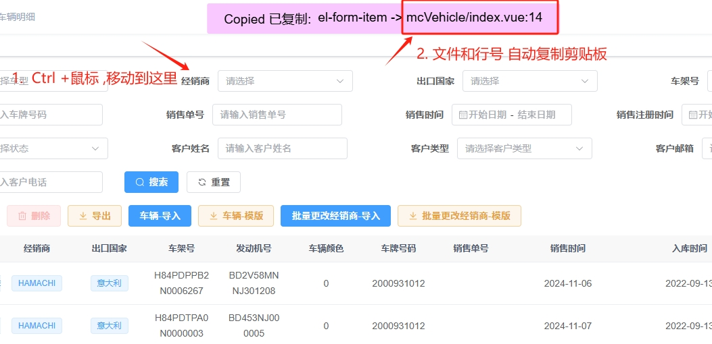
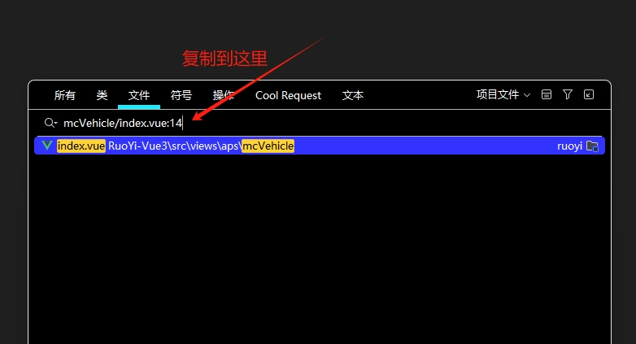
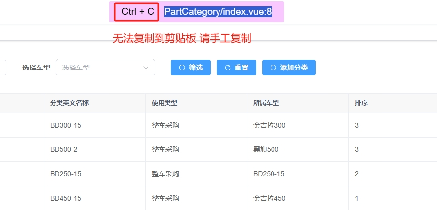

# @line-copy/webpack-loader
A Vite plugin and Vue directive that allows you to copy the source file and line number of components by pressing Ctrl while hovering over them.

一个 Vite 插件和 Vue 指令，支持在按住 Ctrl 键并悬停组件时，复制该组件的源代码文件名和行号。


## ✨ Features 功能特点

- Injects file:line info to specified Vue components (e.g., `<el-button>`)
- 自动向指定的 Vue 组件（如 `<el-button>`）注入 `文件名:行号` 信息
- Adds a `v-line-copy` directive to enable Ctrl+hover copy to clipboard
- 提供 `v-line-copy` 指令，实现按住 Ctrl 悬停即可复制到剪贴板
- Useful for debugging and tracing source
- 方便调试和追踪源代码位置

## 📦 Installation 安装

```bash
npm install @line-copy/webpack-loader --save-dev
```

## 🔧 Usage 使用

### In Webpack config 在 Webpack 配置中引入 loader
```js
// webpack.config.js
const path = require('path');

module.exports = {
    // ...
    module: {
        rules: [
            {
                test: /\.vue$/,
                use: [
                    {
                        loader: '@line-copy/webpack-loader',
                        options: {
                            targets: ['el-button'], // inject to these components
                        },
                    },
                    'vue-loader', // ensure vue-loader comes after ours
                ],
            },
        ],
    },
};

```

### In main.js  在 main.js 中注册插件
```js
import { createApp } from 'vue';
import App from './App.vue';
import LineCopy from '@line-copy/webpack-loader';

const app = createApp(App);
app.use(LineCopy);
app.mount('#app');

```

## 📋 How it works 工作原理
When Ctrl is held and your mouse hovers over a target component, it copies a string like:
当按住 Ctrl 键并鼠标悬停在目标组件上时，会自动复制类似如下格式的字符串：

```
src/components/MyButton.vue:12
```
## 📋 Picture 图片说明
### First 第一步

### Second 第二步

### tips 提示

## 🪪 License
MIT